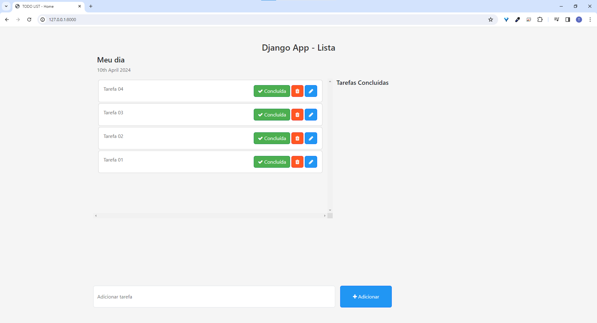
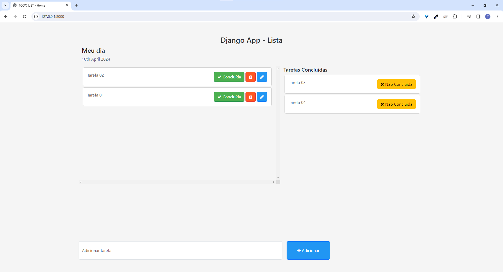
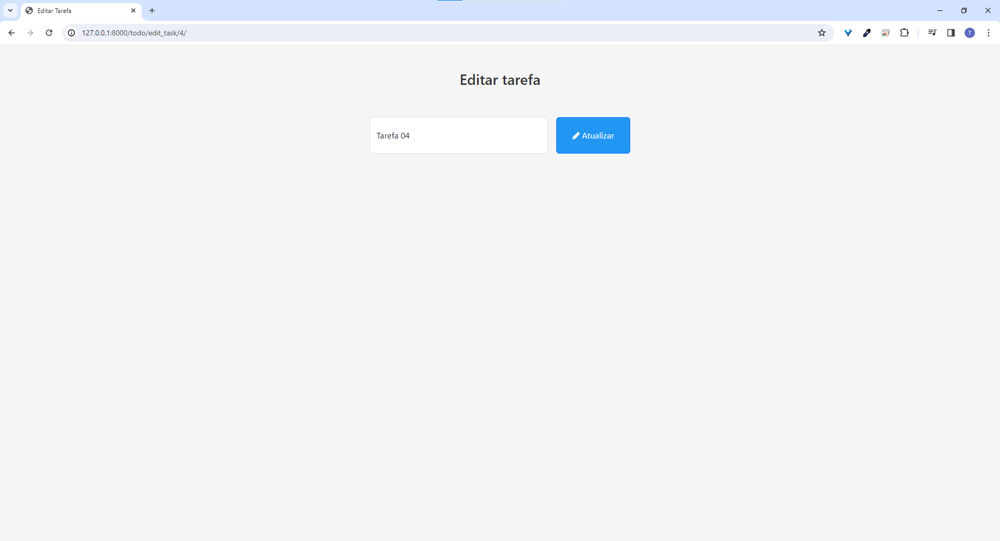
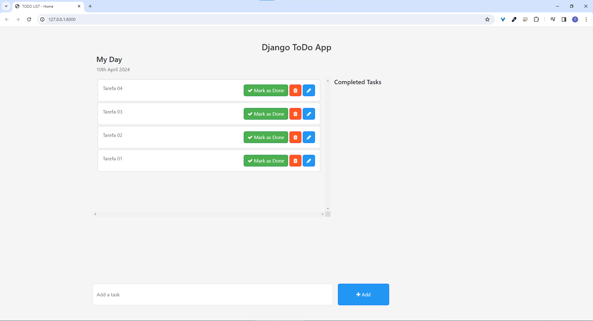
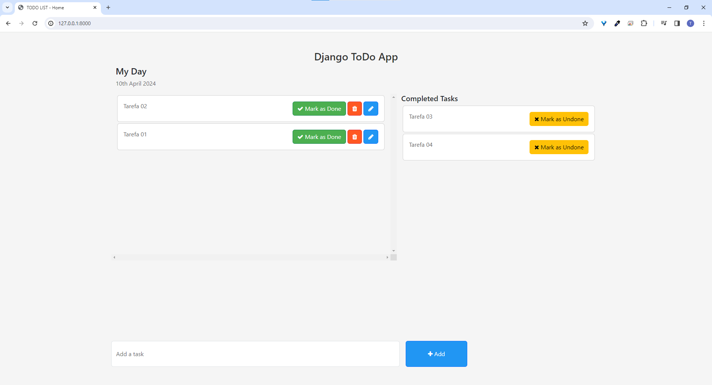

###### Nota: Este README está disponível em Português e Inglês.

###### Note: This README is available in Portuguese and English.

# Meu Dia - Lista de Afazeres

#### Meu Dia é um aplicativo web desenvolvido utilizando Django e Python, projetado para ajudar os usuários a gerenciar suas tarefas diárias de forma eficiente.

### Funcionalidades

#### Tela Inicial: A tela inicial apresenta o título "Meu Dia" seguido da data atual. Abaixo, são exibidas duas seções: uma para as atividades pendentes e outra para as atividades concluídas.

#### Atividades Pendentes: As atividades pendentes são exibidas em cards individuais, cada um contendo um título, um botão para marcar como concluída, um botão para deletar e outro para editar.

#### Adicionar Nova Atividade: Um campo de input permite que os usuários adicionem novas atividades. Ao lado do campo, há um botão para submeter a nova atividade.

#### Atividades Concluídas: As atividades concluídas são exibidas em cards individuais, cada um contendo apenas um título e um botão para desmarcar como concluída.

#### Editar Atividade: Ao clicar no botão de editar em uma atividade pendente, os usuários são levados a uma tela de edição onde podem modificar a tarefa selecionada.

# Instalação

#### Clone o repositório para o seu ambiente local:

`git clone https://github.com/seu-usuario/meu-dia.git`

#### Instale as dependências do projeto:

`pip install -r requirements.txt`

#### Execute as migrações do banco de dados:

`python manage.py migrate`

#### Inicie o servidor de desenvolvimento:

`python manage.py runserver`

#### Acesse o aplicativo no navegador usando o endereço http://localhost:8000 ou http://127.0.0.1:8000/.

# My Day - To-Do List

#### This is a web application developed using Django and Python, designed to help users manage their daily tasks efficiently.

### Features

#### Home Screen: The home screen displays the title "My Day" followed by the current date. Below, two sections are displayed: one for pending activities and another for completed activities.

#### Pending Activities: Pending activities are displayed in individual cards, each containing a title, a button to mark as completed, a button to delete, and another to edit.

#### Add New Activity: An input field allows users to add new activities. Next to the field, there is a button to submit the new activity.

#### Completed Activities: Completed activities are displayed in individual cards, each containing only a title and a button to unmark as completed.

#### Edit Activity: By clicking the edit button on a pending activity, users are taken to an edit screen where they can modify the selected task.

# Installation

#### Clone the repository to your local environment:

`git clone https://github.com/your-username/my-day.git`

#### Install the project dependencies:

`pip install -r requirements.txt`

#### Run the database migrations:

`python manage.py migrate`

#### Start the development server:

`python manage.py runserver`

#### Access the application in your browser using the address http://localhost:8000 or http://127.0.0.1:8000/.
